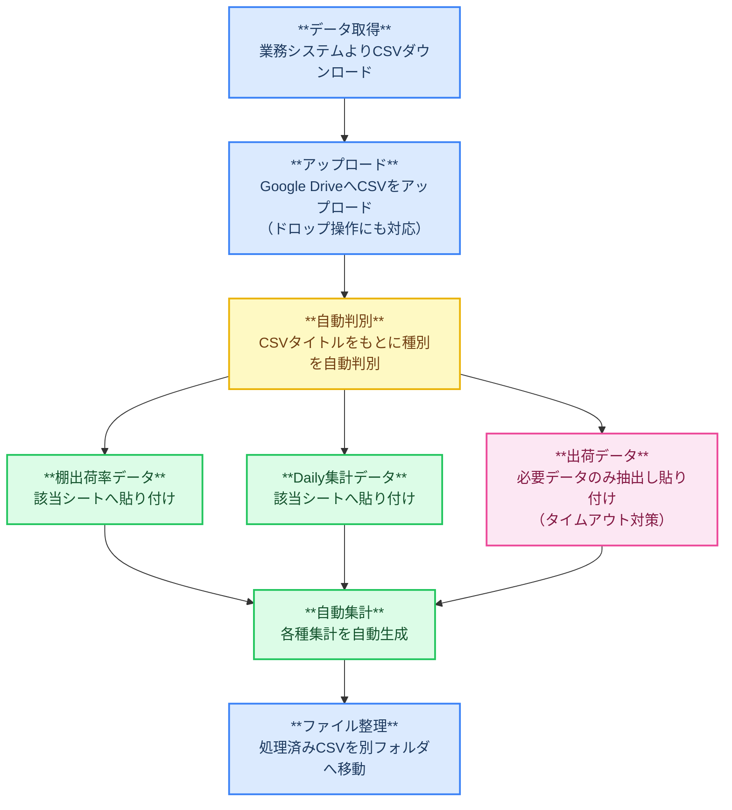

# 締め業務自動化ツール

## 概要

日次の締め作業で発生していた手作業による集計業務を自動化するために開発したツール。  
複数のCSVデータを取り込み、自動集計を行うことで、作業時間短縮と集計ミス防止を実現した。

---

## 開発背景

日次の締め作業では複数システムからCSVを取得し、データ加工・集計・報告資料作成を手作業で行っていた。  
作業量が多く、担当者によって集計時間や品質に差が生じることがあったため、自動化による効率化が必要だった。

---

## 課題

- 毎日同じ作業を繰り返していた
- 複数CSVの確認と加工が必要
- 転記ミスや集計ミスのリスクがあった
- 作業完了まで約1時間を要していた

---

## 実装内容

### CSV取込機能

ダウンロードしたCSVファイルを読み込み、
ファイル名や内容をもとにデータ種別を自動判別して適切なシートへ振り分け。

### 自動集計機能

取り込んだデータをもとに、棚出荷率・Daily集計・出荷データ集計を自動で作成。

### ファイル整理機能

処理済みCSVを自動で別フォルダへ移動し、重複処理や誤処理を防止するとともに、再集計や確認作業に備えて履歴を保持できるようにした。

---

## 使用技術

| 技術 | 用途 |
|------|------|
| Google Apps Script (GAS) | バックエンド処理・自動化 |
| Google Spreadsheet | データ管理・出力 |
| Google Drive | ファイル管理・CSV取込 |
| CSV処理 | 複数CSVの読み込み・集計 |
| Spreadsheet関数 | データ集計・自動計算 |

---

## 処理フロー

## 効果

### 作業時間短縮

約60分かかっていた作業を約20分まで短縮。

### 品質向上

- 転記ミス削減
- 集計漏れ防止
- 作業標準化

### 利用状況

- 毎日利用される標準ツールとして定着
- 複数担当者が利用

---

## 担当範囲

課題発見から開発、運用まで一貫して担当。
---

## 工夫した点

- これまで個別に運用していた集計処理を1つのツールへ統合し、操作を簡略化した
- CSVの内容から対象サイトを自動判別し、利用者が振り分けを意識しなくても運用できるようにした
- 処理済みファイルを自動整理することで、重複処理を防止するとともに、再集計時の確認用データとして保持できるようにした
